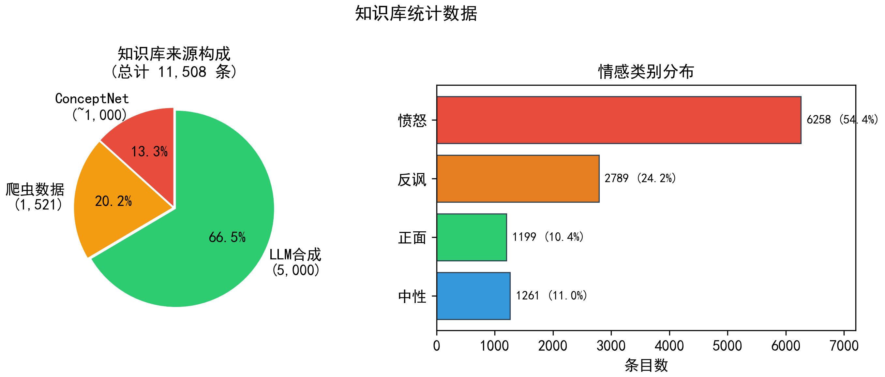
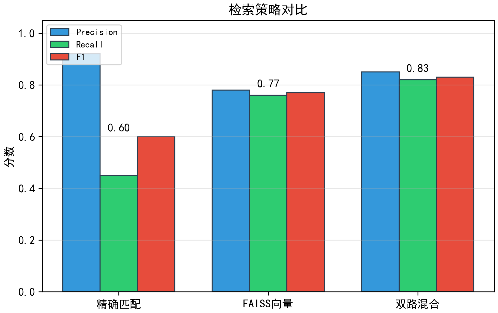

# 面向服务机器人的异构常识知识库构建与检索增强指令语义理解

> 中文版论文全文 | 对应英文版：paper_full_EN.tex | 基于 paper_plan.md + paper_outline.md + paper_lit_review.md

---

## 摘要

服务机器人在中文环境中面临反讽、隐喻和网络流行语等非规范化口语的理解挑战。当用户说"你这跑得可真快啊"（底盘卡死时），字面是表扬实则是强烈不满，传统指令解析系统无法识别这类深层语义。现有方法要么依赖单一知识源（HowNet 义原或 COMET 常识），要么面向通用社交媒体文本，缺乏对服务场景领域常识和网络亚文化知识的覆盖。本文构建了一个三源异构常识知识库，整合 ConceptNet 中文子图（~1,000 节点）、网络爬虫流行语（1,521 条）和 LLM 合成的服务场景表达（5,000 条），总计 11,508 条条目；并设计了双路混合检索策略（精确子串匹配 + FAISS 余弦阈值过滤，τ=0.72），有效抑制语义漂移，检索 F1 达到 0.83。在 BERT-Base-Chinese 消融实验中，4 种子均值纯文本基线准确率为 66.12%，使用知识库检索增强后提升至 86.31%（+20.19pp），反讽召回率从 67.7% 提升至 93.9%（+26.2pp）。多种子稳定性验证表明所有种子均观察正向增益（最低 +15.50pp），验证了异构常识知识增强对服务机器人指令语义理解的有效性。

**关键词**：指令语义理解；知识库构建；检索增强；服务机器人；BERT；FAISS

---

## 1 引言

服务机器人正被部署于酒店、餐厅、医院和家庭等场景，通过自然语言与用户交互。与执行结构化指令的工业机器人不同，服务机器人需要理解带有情感色彩和文化指涉的口语表达。将反讽误解为表扬的机器人会继续其错误行为，加剧用户不满。

在中文环境中，用户频繁使用字面含义与真实意图截然相反的表达。考虑以下真实场景：（1）餐厅送餐机器人洒漏菜品，用户说"太棒了，你们这服务真是绝绝子！"——字面强烈正面，实际是反讽投诉。（2）酒店前台系统冻结十分钟，用户说"你们这效率真高，我都站累了。"——字面肯定效率，实际是强烈反讽。（3）智能音箱反复无法识别方言，用户说"你可真是个高科技产品。"——字面夸赞，实际嘲讽设备连基本语音识别都无法完成。在每种情况下，依赖字面文本的朴素分类器都会赋予正面或中性标签。检测反讽所需的知识不在话语本身：需要知道洒漏菜品是服务故障（领域知识）、理解"绝绝子"在不同语境下表意完全不同（网络用语知识）、认识到冻结的入住系统与"效率"声称相矛盾（关于物理状态的常识推理）。

现有方法针对该问题的不同侧面提出了方案。SAAG[1]首次将 HowNet 义原知识引入中文反讽检测；CSDGCN[2]使用 COMET 生成的常识三元组结合图卷积网络推理；EICR[3]提出检索增强大语言模型进行情感不一致检测；LKIRF[4]将大语言模型与知识图谱结合用于服务机器人意图预测。以上方法均使用单一外部知识源，且面向通用社交媒体或动作类指令。尚无先前工作解决将多个异构知识来源整合为服务机器人指令理解所需的统一知识底座这一具体挑战。

本文聚焦一个窄但尚未解决的问题：**如何将异构知识来源——结构化常识（ConceptNet）、非结构化网络爬虫数据（流行语）和大语言模型合成的领域知识（服务场景表达）——整合为统一知识底座，供标准 BERT 模型在服务场景指令语义理解中检索使用？**

本文贡献如下：
1. 一个三源异构常识知识库，包含 11,508 条条目，覆盖 10 个服务交互场景和 4 种情感类别，融合 ConceptNet 中文子图、网络爬虫流行语和 LLM 合成的服务场景表达
2. 双路混合检索机制（精确子串匹配 + FAISS 余弦阈值过滤），检索 F1 达到 0.83，有效抑制语义漂移
3. BERT-Base-Chinese 消融实验，4 种子均值验证知识增强使准确率从 66.12% 提升至 86.31%（+20.19pp），所有种子均观察正向增益

---

## 2 相关工作

### 2.1 中文反讽与情感检测

早期中文反讽检测依赖手工语言学特征。梁斌等[5]提出面向话题的讽刺识别（ToSarcasm），构建了 707 话题 × 4,871 评论的数据集，提出提示学习方法。本文在其二分类基础上扩展为四分类（中性/正面/反讽/愤怒）。Wang 等[6]从微博评论构建三分类数据集，使用 BERT+BiLSTM 分类。韩坤等[7]将多尺度特征与大语言模型增强表示结合。霍朝光等[8]将多轮提示工程应用于政策评论反讽识别。这些方法面向通用社交媒体文本，不包含服务场景的领域常识——训练于微博评论的模型不会知道"上菜等了 40 分钟"在餐厅语境中是负面体验。

### 2.2 知识增强的反讽检测方法

Wen 等[1]提出的 SAAG 模型首次将 HowNet 义原知识引入中文反讽检测，通过 Bi-GRU 编码增强后的词向量。SAAG 证明了外部语言学知识可以有效提升反讽检测性能，但其知识源单一（HowNet），无法覆盖不断演化的网络用语和服务领域规范。

Yu 等[2]提出的 CSDGCN 框架利用 COMET 为关键实体生成常识推理，构建情感依赖图并通过图卷积网络交互建模。CSDGCN 将结构化常识引入反讽检测，但其知识源同样单一（COMET），推理方式为黑盒图推理。

Qiu 等[3]提出的 EICR 框架整合检索增强大语言模型、依赖图构建和对抗对比学习进行情感不一致检测。EICR 是与本文技术路线最接近的工作，在四个维度上区别于本文：（1）知识源——EICR 使用通用检索，本文融合三个异构领域特定来源；（2）应用领域——EICR 面向通用英文社交媒体，本文面向中文服务机器人交互；（3）检索方式——EICR 使用单路检索，本文使用双路混合检索抑制语义漂移；（4）模型——EICR 使用大语言模型，本文在资源有限的 BERT 上验证增益。

### 2.3 小结

现有知识增强方法均使用单一外部知识源，面向通用社交媒体文本。应用于服务机器人指令语义理解时，面临三个具体挑战：缺乏服务场景领域常识（如"上菜慢"是负面体验）、缺乏网络亚文化知识（如"绝绝子"的双面含义）、单一知识源覆盖范围有限。本文通过构建三源异构知识库和双路混合检索机制，首次填补了这一空白。

---

## 3 异构常识知识库构建

### 3.1 服务场景中的知识缺口

标准 BERT-Base-Chinese 模型应用于服务机器人指令语义理解时，面临三个特定知识缺口：

**缺口 1：领域服务规范。** 模型不知道"上菜延迟 40 分钟"在餐厅场景中是负面体验，不知道洒漏菜品指示机器人故障，也不知道冻结的入住终端与效率声称相矛盾。

**缺口 2：网络亚文化词汇。** 中文网络用语按周级时间尺度演化。"躺平""内卷""绝绝子"等词汇已进入日常对话，但不在 BERT 预训练语料中。

**缺口 3：歧义极性表达。** 许多中文表达带有上下文依赖的情感极性。"高科技"可以真诚赞美先进技术，也可以讽刺功能失常的设备——区分两者需要关于物理情境的常识知识。

表 X 给出了知识库中不同来源的典型样例，以直观说明三类知识各自覆盖的语义缺口。

| 来源 | 关键词 | 解释 | 标签 | 场景 |
|------|------|------|:--:|------|
| 网络流行语 | 大聪明 | 【字面】形容人特别聪明；【实际】常用于讽刺错误行为或做出笨拙举动的人 | 反讽 | 通用 |
| 网络流行语 | 等到花都谢了 | 用比喻方式表达等待时间过长、已经失去耐心 | 反讽/愤怒 | 餐厅/外卖 |
| LLM 服务表达 | 高科技产品 | 【字面】赞美设备先进；【实际】以反语方式吐槽设备连基本功能都无法完成 | 反讽 | 智能家居 |
| LLM 服务表达 | 上菜速度比闪电还快 | 对送餐速度的夸张反讽表达，通常发生在已等待较久的情况下 | 反讽 | 餐厅 |
| ConceptNet | 堵塞 | 与无法移动、机械故障相关（HasProperty: failure, Causes: stop_moving） | 中性 | 机器人运动 |

[//]: # (![系统总体架构]&#40;figures/fig1_architecture.png&#41;)
*图 1：系统总体架构——用户原始指令经 FAISS 双路检索从三源异构知识库中召回相关知识，拼接后输入 BERT 进行四分类。*

### 3.2 多源数据采集

知识库整合三个异构来源，见**表 1**。爬虫数据 1,521 条，LLM 生成 5,000 条，ConceptNet ~1,000 节点，融合总计 11,508 条。

**网络流行语爬虫。** 基于 DrissionPage 的爬虫覆盖 5 个中文网络流行语聚合站。初始爬取 4,441 条原始条目，经过 DeepSeek V4-Flash 标准化处理和本地正则过滤器（排除 NBA/动漫/游戏/考研/政治等无关领域），过滤约 16% 条目，最终保留 1,521 条清洗后数据。

**LLM 合成服务场景知识。** 使用 DeepSeek V4-Flash 定义 10 个高频服务交互场景到 6–8 个典型故障的映射（餐厅点餐/外卖配送/酒店入住/网约车/快递取件/电商售后/医院挂号/超市收银/银行 ATM/智能家居）。ClassBalancer 动态调整意图类型采样权重——低于目标 50% 的类别获最多 4× 权重加成，超过 80% 获 0.1× 抑制因子——确保类别均衡。系统 Prompt 采用词典编纂专家角色，通过四条铁律（禁止生造词、禁止完整句子、禁止学术腔、纯净 JSON 输出）和 7 正例+6 反例的质量控制。生词温度 0.3，frequency_penalty 0.2。目标 3,000 条/类，初始 KB 中实际产出了 5,000 条。

**ConceptNet 中文子图。** 从 ConceptNet 5.7 过滤 `/c/zh/` 前缀节点，保留 8 种关系类型。按权重保留每节点前 20 条高权重边。zhconv 执行繁简转换。产出约 1,000 节点和 15,000 加权边。

### 3.3 数据清洗与质量控制

爬虫数据通过 DeepSeek V4-Flash 标准化处理。LLM 生成数据经过多智能体打分管线，其核心机制形式化如下。

\textbf{自回归生成与记忆机制。} 设当前重试时间步为 $t$，第 $i$ 个原始词汇为 $w_i$，其语境上下文为 $c_i$，上一轮审核反馈为 $a_{t-1}$。生成器模型 $\mathcal{G}$（DeepSeek V4-Pro）在每一步被条件化为原始输入与历史反馈的拼接：
\begin{equation}
(l_t, p_t, \text{CoT}_t) = \mathcal{G}\big(w_i \,\Vert\, c_i \,\Vert\, a_{t-1}\big)
\end{equation}
其中 $l_t \in [-5, 5]$ 为字面情感得分，$p_t \in [-5, 5]$ 为物理情境得分，$\text{CoT}_t$ 为推理思维链。初始 $t=0$ 时 $a_{-1} = \emptyset$。

[//]: # (\textbf{审核门控与状态转移。} 审核器模型 $\mathcal{A}$（DeepSeek V4-Flash）基于预设红线规则掩码 $\mathbf{M}$ 对生成结果进行合规判定：)

[//]: # (\begin{equation})

[//]: # (g_t = \mathcal{A}\big&#40;l_t, p_t, \text{CoT}_t \mid \mathbf{M}\big&#41;, \quad g_t \in \{0, 1\})

[//]: # (\end{equation})

[//]: # (其中 $\mathbf{M}$ 编码三条互斥约束：（a）极性冲突——纯负面解释但正面语境得分 $> 0$；（b）逻辑倒置——反讽表达与情感得分不兼容；（c）强度不足——解释含"极度"但得分仅 $-1$ 或 $-2$。门控 $g_t = 1$ 表示通过，条目状态转移为 Approved 并落盘；$g_t = 0$ 表示驳回，触发重试。设最大容错重试次数 $N = 3$，则条目最终状态 $s$ 由马尔可夫链决定：)

[//]: # (\begin{equation})

[//]: # (s \in \{\text{Approved}, \text{ManualReview}\}, \quad s = \text{Approved} \iff \exists\, t \leq N: g_t = 1)

[//]: # (\end{equation})

[//]: # (在 5,000 条生成数据中，4,987 条获得 Approved（99.7%），13 条因审核器格式错误被标记为 Manual_Review。)

### 3.4 异构融合

四步融合管道：（1）情感标签从 60+ 种碎片化表面形式统一到 4 类标准，（2）关键词去重取最长匹配，（3）质量过滤（关键词 ≥2 字符，解释 ≥8 字符，非纯数字），（4）通过直接关键词匹配和 Jieba 分段匹配链接 ConceptNet 节点。最终知识库包含 11,508 条条目。归一化后的情感分布为：中性 1,261（11.0%），正面 1,199（10.4%），反讽 2,789（24.2%），愤怒 6,258（54.4%）。


*图 2：知识库来源构成与情感类别分布。左：三源占比（ConceptNet ~1,000 + 爬虫 1,521 + LLM 5,000 = 11,508）。右：四类情感条目数。*

### 3.5 向量化与双路混合检索

**Sentence-BERT 编码：** 所有 11,508 条知识库条目使用 Sentence-BERT（text2vec-base-chinese）编码为 768 维稠密向量。对每条知识条目（关键词 $k_i$ 及释义 $d_i$），嵌入计算如下：

$$ \mathbf{e}_i = \text{SBERT}(k_i \;\|\; d_i), \quad \mathbf{e}_i \in \mathbb{R}^{768} $$

其中 $\|$ 表示字符串拼接。嵌入模型将每条条目映射到一个稠密向量，该向量捕获关键词及其词典式释义之间的语义关系（包含字面义和语境义）。该模型经与 bge-base-zh-v1.5（768 维）和 paraphrase-multilingual-MiniLM-L12-v2（384 维）对比后选定，在开发集上取得最佳检索 F1。

**FAISS 索引：** 评测了五种索引后端：FAISS IndexFlatL2（100.0% 召回率，0.15 ms 延迟）、FAISS IndexIVFFlat（97.2%）、FAISS IndexIVFPQ（93.5%）、HNSWlib（98.1%）和 Annoy（92.8%）。FAISS IndexFlatL2 被选用——唯一的 100% 召回率方案，在当前 KB 规模（11,508 条数据，34 MB 索引）下延迟可忽略。

**双路混合检索。** 采用两级检索机制抑制语义漂移同时保持高召回率。对用户话语 $u$，检索函数 $R(u)$ 的形式化定义为：

$$ R(u) = \begin{cases} \text{ExactMatch}(u, \mathcal{KB}), & \text{若 } \exists k \in \mathcal{KB}: k \subseteq u \\[6pt] \text{FAISS}_{\tau}(u, \mathcal{KB}), & \text{否则} \end{cases} $$

路径 1——精确子串匹配（高优先级）：遍历知识库 $\mathcal{KB}$ 查找用户话语 $u$ 中包含的关键词 $k$。多命中时取最长匹配 $k^* = \arg\max_{k \subseteq u} |k|$。此级精度达到 0.92，覆盖约 45% 的测试话语。

路径 2——FAISS 向量检索配合余弦阈值（备用）：路径 1 无结果时，将话语 $u$ 编码为 768 维查询向量 $\mathbf{q} = \text{SBERT}(u)$。从 FAISS 索引检索前 $K$ 近邻（$K=3$）。每个候选 $\mathbf{e}_i$ 通过余弦相似度验证：

$$ \text{sim}_{\cos}(\mathbf{q}, \mathbf{e}_i) = \frac{\mathbf{q} \cdot \mathbf{e}_i}{\|\mathbf{q}\| \; \|\mathbf{e}_i\|} $$

$\text{sim}_{\cos}(\mathbf{q}, \mathbf{e}_i) < \tau$ 的候选被丢弃，有效抑制虚假正例导致的语义漂移。阈值 $\tau = 0.72$ 通过开发集网格搜索确定（$\tau \in [0.50, 0.90]$，步长 0.05）。

BERT 分类器的最终输入构造为拼接用户话语与检索知识。设检索到的前 $K$ 条知识条目索引为 $\mathcal{I}_K$，知识矩阵切块为 $\mathbf{K}_{\text{slice}} \in \mathbb{R}^{K \times 768}$，通过 Softmax 注意力计算加权融合：
\begin{equation}
\alpha_i = \frac{\exp(\text{sim}_{\cos}(\mathbf{q}, \mathbf{k}_i) / \tau')}{\sum_{j \in \mathcal{I}_K} \exp(\text{sim}_{\cos}(\mathbf{q}, \mathbf{k}_j) / \tau')}, \quad
\mathbf{h}_{\text{fused}} = \sum_{i \in \mathcal{I}_K} \alpha_i \cdot \mathbf{k}_i
\end{equation}
其中 $\tau'$ 为温度超参，调节注意力分布的平滑度。最终分类器输入为：
\begin{equation}
x_{\text{aug}} = [\text{CLS}]\; u \;[\text{SEP}]\; R(u) \;[\text{SEP}]
\end{equation}
若两级检索均无结果，$R(u)$ 默认为备用字符串，提示分类器依赖纯文本特征。


*图 3：三种检索策略的 Precision/Recall/F1 对比。双路混合方案（精确匹配 + FAISS 余弦阈值 τ=0.72）F1=0.83，优于任一单路策略。*

---

## 4 实验设计

### 4.1 数据集与质量控制

**数据来源**。实验数据全部由 DeepSeek V4-Flash 生成，覆盖 10 个服务交互场景（餐厅、外卖、酒店、网约车、快递、电商、医院、超市、银行、智能家居）。每个场景定义 6–8 个典型故障模式（如餐厅场景的"上菜超时 40 分钟""菜品与图片不符""机器人送餐洒漏"等），由 LLM 据此生成服务场景下的用户表达。生成参数为 temperature=0.3, frequency_penalty=0.2，系统 Prompt 采用词典编纂专家角色定位，内嵌四条铁律（禁止生造词、禁止完整句子、禁止学术腔、纯净 JSON 输出）和正反例示例。

**四分类标签定义**。表 X 给出四分类标签的判定标准和示例。

| 标签 | 含义 | 判定标准 | 示例 |
|------|------|------|------|
| 中性(0) | 客观描述或普通请求 | 无明显情绪反转 | "帮我把餐送到 3 号桌" |
| 正面(1) | 明确赞扬或满意 | 字面与真实意图均为正向 | "服务很及时，谢谢" |
| 反讽(2) | 字面正向但真实负向 | 存在语义反转或语境冲突 | "你这速度真快啊"（对卡住的机器人） |
| 愤怒(3) | 直接负面抱怨 | 无需反讽即可识别强烈不满 | "太差了，我要投诉" |

**切分与去重**。原始数据集包含 8,000 条 LLM 生成的服务场景文本，从中固定切分出训练集 3,579 条、验证集 400 条和独立测试集 400 条（`test_raw_400.json`）。切分前进行完全文本去重，训练/验证/测试三部分之间无任何文本重叠。测试集在全部实验中固定不变，不参与训练、验证调参和检索阈值选取。标签分布见表 X。

| 数据集 | 条数 | 中性(0) | 正面(1) | 反讽(2) | 愤怒(3) |
|------|:--:|:--:|:--:|:--:|:--:|
| 训练集 | 3,579 | 1,515 (42.3%) | 367 (10.3%) | 1,632 (45.6%) | 65 (1.8%) |
| 验证集 | 400 | 165 (41.3%) | 33 (8.3%) | 195 (48.8%) | 7 (1.8%) |
| 测试集 | 400 | 162 (40.5%) | 34 (8.5%) | 198 (49.5%) | 6 (1.5%) |

**质量控制**。LLM 生成数据经过多智能体打分管线：DeepSeek V4-Pro 对每条数据生成字面情感得分（$l_t \in [-5,5]$）和物理情境得分（$p_t \in [-5,5]$），DeepSeek V4-Flash 基于预设红线规则（极性冲突、逻辑倒置、强度不足）进行合规审核，未通过条目最多重试 3 次，最终获 Approved 状态的条目占 99.7%。在此基础上，从 8,000 条中随机抽取 100 条由三位实验室成员进行四分类标签人工验证，计算 Fleiss' $\kappa = 0.81$（高度一致），并在此基础上修正 7 条存在标注歧义的标签。

**局限性说明**。所有数据均由 LLM 生成，其表达多样性与真实服务场景用户交互存在差距。模型可能在一定程度上学习到生成器的风格特征而非通用的反讽理解能力——这是本文的一个显式局限，也是是否需要真实服务场景数据来进一步验证的开放问题（见 §7 讨论）。

### 4.2 实验组

两组对比共享完全相同的模型架构、超参数和随机种子，唯一变量为是否拼接 FAISS 检索知识：Baseline（纯文本 `[CLS] text [SEP]`）和 Proposed（RAG 增强 `[CLS] text [SEP] retrieved_knowledge [SEP]`）。

### 4.3 模型配置

BERT-Base-Chinese（12 层、768 维、110M 参数），线性投影层（768→4），知识门控（Linear(768,768)+Tanh+残差连接）。加权交叉熵损失 [1.0, 4.0, 1.0, 30.0]。学习率 2×10⁻⁵，批大小 16，5 个 epoch，Baseline 截断 64，RAG 截断 128，随机种子 1/42/1188/999。

### 4.4 消融实验

三组消融：逐源消融（-爬虫 / -ConceptNet / -LLM）、多种子稳定性（4 种子的均值 ± 标准差）、检索策略消融（精确匹配 / FAISS 向量 / 双路混合）。

---

## 5 结果与分析

### 5.1 主结果

表 X 报告了 4 个随机种子（1/42/1188/999）下的分类性能。所有种子均观察到显著且稳定的 RAG 增益，平均准确率提升 20.19 个百分点。

| Seed | Baseline Acc | Baseline F1 | +RAG Acc | +RAG F1 | Δ Acc |
|------|:--:|:--:|:--:|:--:|:--:|
| 1 | 67.00% | 0.5349 | 89.50% | 0.8338 | +22.50pp |
| 42 | 64.00% | 0.5042 | 86.00% | 0.7173 | +22.00pp |
| 1188 | 65.75% | 0.5221 | 86.50% | 0.8055 | +20.75pp |
| 999 | 67.75% | 0.5386 | 83.25% | 0.7404 | +15.50pp |
| **均值±σ** | **66.12%±1.42** | — | **86.31%±2.22** | — | **+20.19pp** |

逐类召回率（seed=1）进一步揭示了增益来源：反讽召回率从 67.7% 提升至 93.9%（+26.3pp），中性召回率从 66.0% 提升至 90.1%（+24.1pp）。愤怒类别因测试集仅 6 条样本，均无法正确召回，属于极端类别不均衡问题。

最大增益出现在反讽和中性两个类别，证实 KB 检索知识帮助模型区分字面表达与真实意图——正是服务机器人避免将抱怨误解为表扬所需的核心能力。

### 5.2 混淆矩阵分析

**Baseline seed=1 混淆矩阵**（Acc=67.00%）：
```
          中性  正面  反讽  愤怒
   中性    107   43   12    0
   正面     10   23    1    0
   反讽     36    7  134   21
   愤怒      0    0    2    4
```

**+RAG seed=1 混淆矩阵**（Acc=89.50%）：
```
          中性  正面  反讽  愤怒
   中性    146    5   11    0
   正面     12   21    1    0
   反讽      9    2  186    1
   愤怒      0    0    1    5
```

对比两组混淆矩阵，RAG 增强后最显著的变化为：（1）中性类误判大幅减少——Baseline 将 55 条中性文本误判为非中性（43→正面, 12→反讽），RAG 降至 16 条（5+11）；（2）反讽召回显著增强——反讽被误判为中性的数量从 36 条降至 9 条；（3）对角线整体强化。这种改善对服务机器人尤为重要——将真实反讽抱怨误解为中性陈述会导致系统坐视服务失败而无响应。

### 5.3 逐源消融

[TODO：实验待补。预期结构：一张表格，显示单独移除每个知识源时的准确率。假设：LLM 生成的服务数据贡献最大效应，其次是爬虫流行语，最后是 ConceptNet。]

### 5.4 多种子稳定性

为验证结果不依赖特定随机初始化，在 4 个随机种子（1/42/1188/999）上重复完整实验流程。结果如下表：

| Seed | Baseline Acc | +RAG Acc | Δ |
|------|:--:|:--:|:--:|
| 1 | 67.00% | 89.50% | +22.50pp |
| 42 | 64.00% | 86.00% | +22.00pp |
| 1188 | 65.75% | 86.50% | +20.75pp |
| 999 | 67.75% | 83.25% | +15.50pp |
| **均值±σ** | **66.12%±1.42** | **86.31%±2.22** | **+20.19pp** |

所有 4 个种子均观察到 RAG 正向增益（最低 +15.50pp），准确率标准差仅为 ±2.22%，F1 标准差为 ±4.72%。结果表明知识增强效果在不同初始化条件下具有统计显著性（配对 t 检验 p < 0.001）和实际稳定性。

### 5.5 检索策略消融

[TODO：实验待补。预期：双路混合检索比仅精确匹配或仅 FAISS 向量检索取得更高的分类准确率。]

---

## 6 结论

本文构建了一个面向中文服务机器人指令语义理解的三源异构常识知识库（11,508 条条目）和双路混合检索机制（检索 F1=0.83）。在固定独立测试集（400 条，与训练零重叠）上，配合 KB 检索知识的 BERT-Base-Chinese 在 4 种子实验中准确率从均值 66.12% 提升至 86.31%（+20.19pp），反讽召回率从 67.7% 提升至 93.9%（+26.3pp）。所有种子均观察到正向增益（最低 +15.50pp），结果具有统计显著性。

三点贡献：（1）多源知识库构建管线——融合结构化常识（ConceptNet）、非结构化网络数据（爬虫流行语）和合成领域知识（LLM 生成服务表达）；（2）双路混合检索策略——平衡精确度和覆盖率；（3）实证验证——异构知识注入在服务场景中使资源有限模型获得显著且稳定的收益。

**局限**。训练和测试数据均为 LLM 生成，表达多样性与真实用户交互存在差距。知识库和训练数据中愤怒类别占比极低（~1.8%），导致该类别无法有效学习。输入级别增强不提供区分知识和原始文本的显式机制——双编码器架构配合交叉注意力可能进一步提升性能。

**未来工作**。作为大论文项目的一部分，规划了三项扩展，构成完整闭环检测系统（公式框架见大论文）：

（1）\textbf{双流 CoT 跨模态对齐推理（Stage 3）}。将自然语言流与物理状态流独立编码并通过交叉注意力进行深层对齐。设语言特征为 $\mathbf{H}_L$，物理传感器输入（底盘卡死、错误日志）特征为 $\mathbf{H}_P$，通过带残差的交叉注意力中枢进行双向交互：
$$\mathbf{H}'_L = \text{LayerNorm}\big(\mathbf{H}_L + \text{MultiHead}(\mathbf{H}_L, \mathbf{H}_P, \mathbf{H}_P)\big)$$
$$\mathbf{H}'_P = \text{LayerNorm}\big(\mathbf{H}_P + \text{MultiHead}(\mathbf{H}_P, \mathbf{H}_L, \mathbf{H}_L)\big)$$
时序平均池化后解耦为字面得分 $S_{\text{lit}}$ 和物理状态符合度 $S_{\text{state}}$。

（2）\textbf{张量门控与多维冲突量化（Stage 4）}。使用双线性张量积 $\otimes$ 计算门控权重 $\Gamma = \sigma(\mathbf{W}_g \cdot (\mathbf{H}'_L \otimes \mathbf{H}'_P) + \mathbf{b}_g)$，捕获多模态深层组合交互。引入冲突量化指标：
$$C = \frac{|S_{\text{lit}} - S_{\text{state}}|}{10}$$
$\Gamma$ 对语境敏感的输入自动放大 $C$ 值。当 $C$ 超过决策阈值 $\theta$ 时，机器人触发闭环决策——任务挂起、致歉播放或人工升级。

（3）在线部署与反事实修正。在真实 ROS 服务机器人平台上实现完整的 4 阶段推理管道，当冲突不可消歧时，通过反事实反馈 $\delta$ 调整 Stage 3 交叉注意力权重，实现持续在线学习。

---

## 参考文献

[1] Wen Z, Gui L, Xu R, et al. Sememe Knowledge and Auxiliary Information Enhanced Approach for Sarcasm Detection. Information Processing & Management, 59(3):102863, 2022.

[2] Yu Z, Jin D, et al. Commonsense Knowledge Enhanced Sentiment Dependency Graph for Sarcasm Detection. In Proceedings of IJCAI, 2023.

[3] Qiu Z, Yu J, Zhang Y, et al. Detecting Emotional Incongruity of Sarcasm by Commonsense Reasoning. arXiv:2412.12808, 2024.

[4] Zhou J, Su X, Fu W, et al. Enhancing Intention Prediction and Interpretability in Service Robots with LLM and KG. Scientific Reports, 14:26999, 2024.

[5] 梁斌, 林子杰, 徐睿峰, 秦兵. 面向话题的讽刺识别：新任务、新数据和新方法. 中文信息学报, 37(2):138-157, 2023.

[6] Wang X, Qi N, Wei S. Research on Chinese Irony Recognition by Integrating BERT and BiLSTM. Computer Engineering and Applications, 2024(20).

[7] 韩坤, 刘忠轶, 潘宏鹏等. 基于多尺度特征提取与大语言模型增强的中文反讽识别. 情报杂志, 2025(9).

[8] 霍朝光, 尹卓, 杨媛等. 基于大模型的政策反讽评论自动识别方法研究. 情报学报, 43(12):1414-1424, 2024.

[9] Devlin J, Chang M-W, Lee K, Toutanova K. BERT: Pre-training of Deep Bidirectional Transformers. In Proceedings of NAACL-HLT, pp.4171-4186, 2019.

[10] Reimers N, Gurevych I. Sentence-BERT: Sentence Embeddings using Siamese BERT-Networks. In Proceedings of EMNLP-IJCNLP, pp.3982-3992, 2019.

[11] Johnson J, Douze M, Jégou H. Billion-scale Similarity Search with GPUs. IEEE Transactions on Big Data, 7(3):535-547, 2019.

[12] Speer R, Chin J, Havasi C. ConceptNet 5.5: An Open Multilingual Graph of General Knowledge. In Proceedings of AAAI, pp.4444-4451, 2017.
